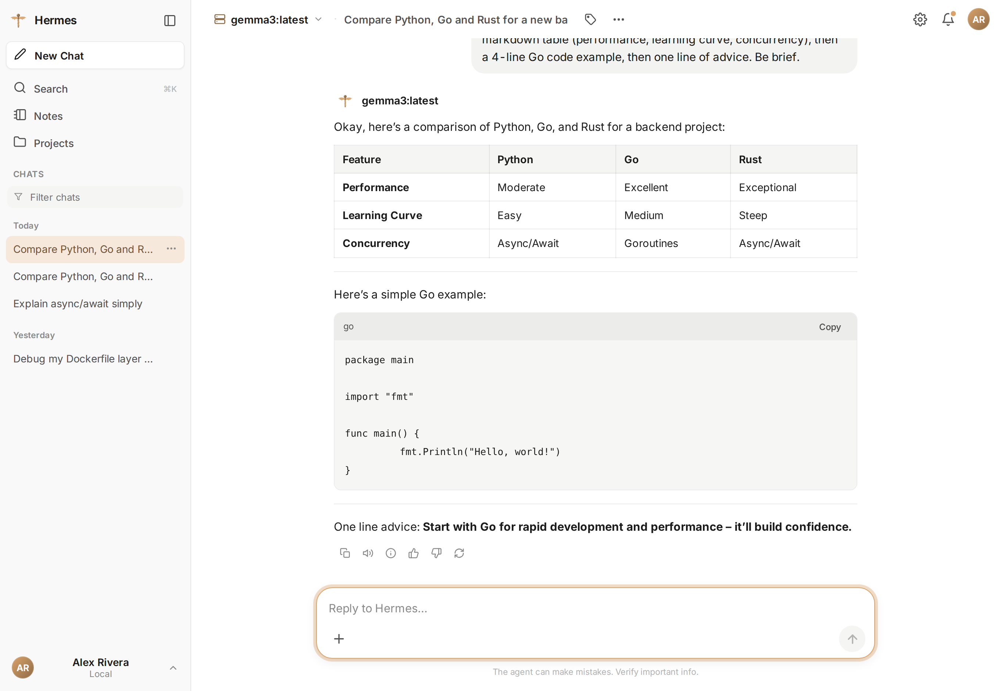
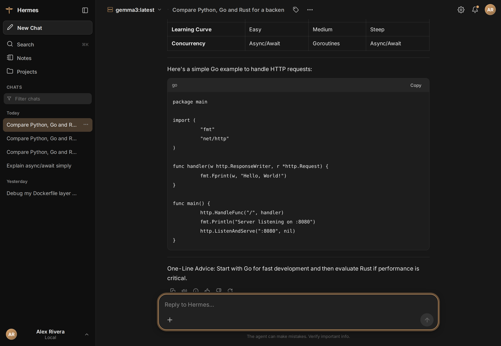
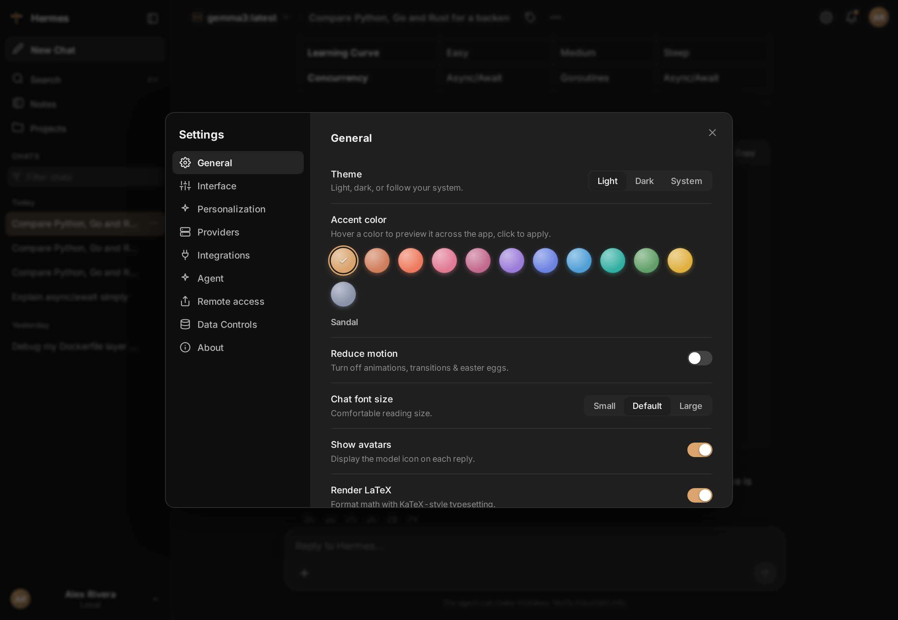
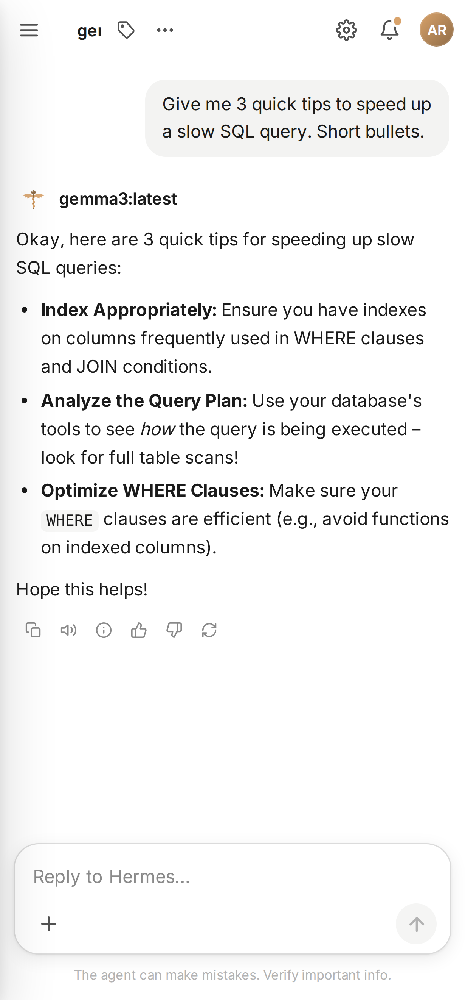

<div align="center">

# 🐚 AgentBay

**A minimal chat home for your local AI agent.**

*No build. No node_modules. No clutter. Just Python 3 and your browser.*



</div>

---

## Why this exists

AgentBay was created with two things in mind:

1. **[Hermes](https://github.com/NousResearch) is a powerful agent — but it has no UI.** It lives in the terminal.
2. **The open-source chat UIs that do exist are quite complex.** Dozens of panels, build tools, Docker files — too much, too soon.

So I built the missing middle: **one minimal UI that even non-tech users can handle.** Your mom could install it. Your teammate who's never opened a terminal can chat with a real agent — one that runs commands, reads files, and browses the web — from a page that looks as friendly as any chat app.

It's built first as a **minimal UI for the Hermes agent** — and now **OpenClaw** too. Both stream live through AgentBay (replies, the agent's thinking, its tool calls, real Stop), each with its own brand and a cute thinking animation. Pick whichever you like under Settings → Agent.

> **Honest note:** Hermes and OpenClaw are both tested. Any *other* agent is best-effort — you may hit issues. If you do, or if you need a feature, [just let me know](https://github.com/NullNaveen/agentbay/issues). I read everything.

## Install

**macOS / Linux**
```bash
curl -fsSL https://raw.githubusercontent.com/NullNaveen/agentbay/main/install.sh | bash
```

**Windows (PowerShell)**
```powershell
irm https://raw.githubusercontent.com/NullNaveen/agentbay/main/install.ps1 | iex
```

Or from a clone:
```bash
git clone https://github.com/NullNaveen/agentbay.git
cd agentbay
python3 server.py
```

It opens at `http://127.0.0.1:8700` (or the next free port). No Python? The installer sets it up for you. The first run also drops an **AgentBay icon** on your Desktop / Applications / Start Menu — after that, no terminal ever again.

## What you get

- **Chat with a real agent** — it runs commands, edits files, browses the web. You watch its thinking, its tool calls, and its live task plan as it works.
- **Any model, your keys** — DeepSeek, OpenAI, Claude, Gemini, or a local server (Ollama / LM Studio / MLX). Or borrow the providers your agent is already signed into — no key to paste.
- **Friendly everywhere** — phones, tablets, light/dark, markdown, math, diagrams. Share a private link (with QR) to use it from your phone.
- **Yours** — everything stays on your machine. Keys live in `~/.agentbay/config.json` (chmod 600). Optional password lock when you open it to the network.

**There's a lot more under the hood** — a chart dashboard, scheduled tasks, image input, slash commands, and a drawer full of optional settings.

<div align="center">

| Dark mode | Settings | On your phone |
|:---:|:---:|:---:|
|  |  |  |

<sub>Shown with the built-in <b>Hermes</b> skin. Every screen adapts to light/dark and to your phone.</sub>

</div>

### 📖 **[Read the full guide → FEATURES.md](FEATURES.md)**

### 🧪 **[Two agents working together (experimental) → EXPERIMENTAL.md](EXPERIMENTAL.md)**

If you have both Hermes *and* OpenClaw installed, AgentBay can run them as a pair — answering side by side, or **collaborating on one task** (taking turns, handing off, reviewing each other, with their conversation visible to you). It's off by default and still a sandbox — **[ideas and corrections very welcome](https://github.com/NullNaveen/agentbay/issues).**

## Update & uninstall

An **"Update available"** banner appears in the app whenever a new version is on GitHub — one click updates and reloads. (Or: Settings → About → Check for updates.)

Uninstall = delete one folder. Nothing is installed system-wide:
```bash
rm -rf ~/.agentbay        # macOS / Linux
Remove-Item -Recurse -Force "$HOME\.agentbay"   # Windows
```

## Issues & ideas

Found a bug? Want a feature? **[Open an issue](https://github.com/NullNaveen/agentbay/issues)** — or just tell me. This project grows from real requests.

## License

MIT — see [LICENSE](LICENSE).
